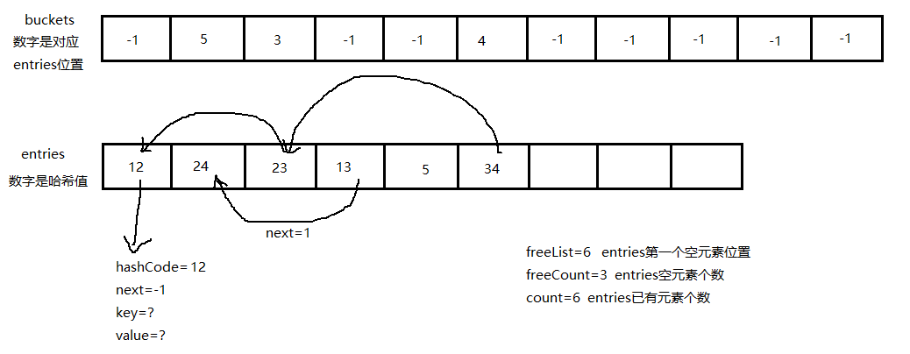

# 源码分析

[源码网站](https://referencesource.microsoft.com/)

## 结构特点

Dictionary:
+ 使用自定义的结构体`Entry`来存储每个key/value项的内容，其中包含了当前元素的hashCode, hash冲突的Entry下标next(int)，key,和value
+ 在Dictionary类中有两个重要的存储空间`int[] buckets`和`Entry[] Entries`两者均是动态数组，`buckets`用于存放每个entry的索引，而entry会具体存放每个项的内容
    + entry使用的是动态数组来模拟链式存储，因此每个entry内部存放了hash冲突的下一个数据的位置next，如果没有则为-1
    + 因为使用数组模拟链式存储，每次扩容都需要对hash冲突重新计算。
+ 字典类中还使用了freeList和freeCount来表示剩余空间，默认为0，只有在使用了`Remove()`方法以后才会使用两个变量
    + 由于Entry是结构体，`Remove()`方法会将被移除的变量hashcode置为-1,表示该位置为空，且key和value设置为默认值，但是Next不会发生改变。
    + 因此freeList能够方便找到剩余的空空间
+ 在没有freeCount时，每次默认向Entry数组第一个为空的空间添加数据
+ 由于是模拟链表，因此处理冲突的插入方法是 **头插法**，也就是说新的hash冲突的数据会指向早进入链表的数据，如果34后插入，但是其会指向23；而buckets对应的索引指向最新的数据（34）

> 引用自 [字典源码解析](https://www.cnblogs.com/wintertone/p/11988412.html)
> 
> 图展示一个索引数组(`buckets`和数据数组`entrys`)，其中索引记录了某一个key的hashcode对应在数组数组的`index`。如`buckets[1] = 5`则表示元素34的hash值对应的位置在`entries[5]`上 
>
> 而`entries`每个元素的next表示了和其hash冲突的元素的位置，直到next为-1
> 
> 上图中所有未表示空间均为-1 
> 上图中`buckets`和`entries`的空间容量应该一致（**图有问题，建议看下一篇文章的图表**）

> 参考资料[C#Dictionary源码剖析](https://blog.csdn.net/fdyshlk/article/details/76407397)

HasSet:
+ 实现方式与字典几乎一致，均是通过索引表和散列表的方式完成（使用了`int[] m_buckets`和`Slot[] m_slots`。
+ `Slot`和字典的`Entry`完全一致，仅缺少value值
+ 在HashSet中，源码没在在初始化数组时将所有元素表示符设置为-1，因此在后续设置元素内容时都需要-1，以表示当前位置未被使用。
+ 同时每次在设置bucket的内容（Slot索引）时，都在Index的基础上+1，以将下标从1开始展示（每次获取Slot索引会将其-1，保证正常获取）

## 底层实现

**普通数组**
Array
+ 是所有数组的基类，且因为是一个抽象类，不同于其他所有数据结构有单独的存储空间，Array类更多用于Array相关的方法。
+ Array类可以通过`Array a = Array.Empty<int>(); Array.resize(a, 3);`去构造一个数组，其类型是对应类型的System数组如上述int数组的类型`System.Int32[]`,通过`int[] a = new int[3];`得到的数据与上述方式相同
+ Array数组是一个引用类型，其指向了内存中一段固定空间的首地址。但其中的每个值的类型需要基于值本身判断，如Int[]中的每一个元素都是值类型。
+ Array类继承了`IList`，但其中的add方法在Array类中被修改为执行即报错。
+ Array中随机搜索都是通过重新`IList`的方法`GetValue()`和`SetValue()`实现的

**动态数组**

ArrayList:
+ Object类型的动态数组，因此其不需要定义存储数据的类型，但每次存储都需要装箱
+ Arraylist是一个类，其内部有一个Object[] 类型的成员变量存储数组元素。

Stack:
+ 使用Object类型的动态数组实现，默认容量为10，
+ 如果是接受ICollection类型进行初始化，要么初始容量为32，要么为参数数据的长度
+ Stack任何操作都从`_size`(元素长度，也就是最后一个元素的下标)出发

Queue:
+ 使用Object类型的动态数组实现，默认容量和最小扩容量为4
+ 队列有一个扩容因子([1，10]闭区间，可设置小数点)，也就是扩容倍数
+ 逻辑上是循环队列，需要头指针和尾指针（实际是int）表示
    > 部分对整段数据操作（clone、copyto等）需要分为[_head,到数组尾部]，[数组头部，_head）两个部分进行

Dictionary:
+ 使用自定义结构体Entry的动态数组实现
+ Entry结构体包含了hashCode, 下一个Entry地址(int)，key,和value

Dictionary:
+ 使用自定义结构体Slot的动态数组实现
+ Entry结构体包含了hashCode, 下一个Slot地址(int)，key

**链表**

LinkedList: 

+ 每个node中存放了其前驱和后继的引用
+ 使用了一个环形双向链表，每个节点包括了其前驱和后继，以及所在链表的信息
+ 每个链表包含了头节点的位置，其尾节点为头节点的前驱

## 初始化和扩容方法

**设置初始值并两倍扩容**

ArrayList
+ 初始容量是4，如果容量不够时采用两倍扩容
+ 扩容时生成一段新的空间，然后将原内容复制到新的空间

Stack
+ 初始容量是10，设置存储数据的数组`_array`为默认长度
+ 如果容量不足，则基于当前`_array`大小两倍扩容
+ 扩容时生成一段新的空间，然后将原内容复制到新的空间

**设置初始值并自定义扩容**

Array
+ 如果指定了初始容量则以数组长度初始容量
+ 无法自动扩容，如果需要扩容，要通过Array类的静态方法`Array.resize(ref arr, newSize)`
+ 如果数组原本为空，则新生成一段空数组；不为空则需要进行复制

Queue
+ 初始容量为4，可以自定义扩容倍数，默认为两倍扩容
+ 如果扩容时，新增容量小于最低扩容量4，则扩容4个单位
+ 扩容时分类根据头指针和尾指针位置分为两种情况，判断是否需要分为两个部分执行数据复制
+ 每次扩容`_head`都从0开始统计

> 每次扩容都会导致原有的头指针和尾指针失效

Dictionary

+ 初始化需要同时以相同的初始值分别初始化`buckets`数组和`entries`数组
+ 手动定义初始值 ≠ 实际的存储容量
+ Dictionary会通过`HashHelpers.GetPrime(cnt)`去获取一个大于自定义初始容量的素数，以此作为实际的存储容量，防止冲突
    + 获得的方式会优先去查找质数表，如果找到大于等于目标值最小的质数，则返回
    + 否则不断在该数的基础上+2，判断是否为质数
+ 当需要扩容时，会采用`HashHelpers.ExpandPrime(cnt)`方法去获取扩容的素数，首先是对当前容量2倍扩容，保证是个偶数，然后判断是否为素数，如果不是则在原基础上不断加2，直到找到一个素数
+ 由于扩容会修改`buckets`容量，而计算`Entry`的索引需要桶容量，因此扩容后需要分别修改`buckets`的内容和`Entry`中每个变量的next
    + 根据新的扩容空间创建新的`Buckets`和`Entry`空间，然后将`Entry`全部复制到新空间
    + 基于新的容量分别修改`bucket`指向的`Entry`索引，以及每个`Entry`对应的next

HashSet

+ 与字典一致，分为 `buckets`数组和`Slot`数组
+ 扩容和初始化方法也一致

**不需要扩容**
LinkedList
+ 初始为空链表，添加节点则是修改每个节点对应的前驱和后继
+ 向空链表添加数据时，前驱和后继指向自己

## 插入数据方法

**插入末端和随机插入都有**

ArrayList
+ 有两种插入数据的方式，`Add`方法会默认插入到存储空间末尾；`Insert`方法可以选择要插入的位置
+ `Insert`方法插入数据会将从指定位置的数据依次向后移动

LinkedList
+ 分为插入到指定节点前和插入到队首和队尾
+ 插入到指定位置前，需要首先确定指定节点，然后修改两个节点分别的前驱和后继
    >插入队首则是指定节点为首节点，而插入队尾则是插入到首节点之前（**不修改首节点的指示标记**）

**末端插入**
Stack
+ 先判定是否需要扩容，然后向数组末端插入数据，增加使用长度统计`_size`

Queue
+ 先判断`_size`是否等于`_array`的长度，相等则扩容
+ 否则在队列的逻辑末端插入数据

    > 逻辑队尾始终指向队尾数据的后一个空间位置，因此当队列满时，_head == _tail

Dictionaty:
+ 先计算插入数据的哈希值，然后判断是否需要扩容
+ 根据哈希值计算出目标索引，修改`Bucket`数组中需要的Entry变量索引
+ 当需要插入时，先判断是否有`freeCount`，如果有则先使用空置的空间
+ 如果没有空置空间，则向Entry数组第一个为空的空间添加数据
+ 由于是模拟链表，因此处理冲突的插入方法是头插法，也就是说新的hash冲突的数据会指向早进入链表的数据

HashSet:
+ 与Dictionary一致

**不支持插入**

Array
+ 不支持向数组中插入数据，直接根据下标设置即可，如果超出容量，需要resize

## 移除数据

**覆盖数据**
ArrayList:
+ 从后往前将需要被移除的数据覆盖

Dictionary
+ 基于key找出元素对应的“逻辑链表”，然后修改删除元素的前驱的next值修改为自己的next
+ 将当前元素的hashCode改为-1，key和value改为默认值，next交给freeList控制（初始值为-1），后续为上一个被删除的`Entry`索引
+ freeCount++;

HashSet:
+ 与Dictionary一致

**移除数据**
LinkedList
+ 修改后继节点和前驱节点对应的内容, 当前元素交由GC处理

Stack
+ 将队尾元素置为null，减少长度统计量`_size`

Queue
+ 将逻辑队头元素置null,减少队列长度统计量`_size`，队头循环前进一位

**不支持移除**

Array
+ 不支持移除Arr数据