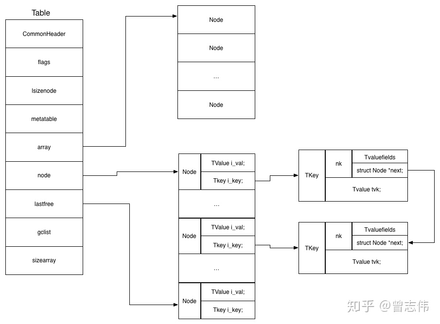
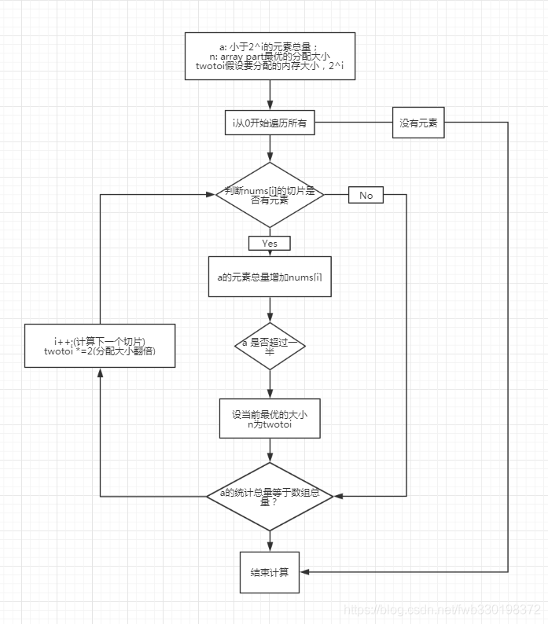

# table源码分析
Lua的table数据结构主要由`ltable.c`和`ltablib.c`构成，其中`ltable.c`主要定义了table的基础存取方法（包括创建，存取值，free等）；`ltablib.c`提供了table常用的辅助接口（遍历，插入，移除，排序等）

> `ltablib.c`主要实现功能
```c
static const luaL_Reg tab_funcs[] = {
  {"concat", tconcat},
  {"foreach", foreach},
  {"foreachi", foreachi},
  {"getn", getn},
  {"maxn", maxn},
  {"insert", tinsert},
  {"remove", tremove},
  {"setn", setn},
  {"sort", sort},
  {NULL, NULL}
};
```
## table基础元素

Lua的基础数据结构，包括GCobj, table等数据都是存储在`lobject.h`中

```c
typedef struct Table {
  CommonHeader;
  lu_byte flags;  /* 1<<p means tagmethod(p) is not present */ 
  lu_byte lsizenode;  /* log2 of size of `node' array */
  struct Table *metatable;
  TValue *array;  /* array part */
  Node *node;     // 指向一段存放node节点的内存空间，每个node节点的key会指向冲突节点，实现拉链
  Node *lastfree;  /* any free position is before this position */
  GCObject *gclist;
  int sizearray;  /* size of `array' array */
} Table;

```

其中`lu_byte`实际上是`typedef unsigned char lu_byte;` 其中 `unsigned char`是一个无符号字符，范围从0~255，用以表示一个字节 

`CommonHeader`是一个标记头，用以标记所有可用于回收的资源。任何需要进行GC操作的Lua数据类型，都会有一个 CommonHeader宏定义的成员，且定义在结构体的最开始部分。

`TValue`是一个结构体，存放了名为`TValuefields`的宏定义，该定义中包含了一个类型为`Value`的值和Value对应的类型`tt`

```c
#define TValuefields    Value value; int tt
```

其中`Value`是一组类型的union
```c
typedef union {
  GCObject *gc;
  void *p;
  lua_Number n;
  int b;
} Value;
```

`Node`存储了table中的每一个键值对
```c
typedef struct lua_TValue {
  TValuefields;
} TValue;

typedef union TKey {
  struct {
    TValuefields;
    struct Node *next;  /* for chaining */
  } nk;
  TValue tvk;
} TKey;

typedef struct Node {
  TValue i_val;
  TKey i_key;
} Node;

```
上述代码表示了在table中，每一个node都有key和value，其中key有两种情况，分别是只有单个TValue内容和存储Value内容，并通过next指向下一个node的指针。



>  [图片引用](https://zhuanlan.zhihu.com/p/295524176)

## ltable.c源码分析

### table的新建
table表的建立主要工作是为每一个部分分配内存块，同时对table的属性以及内存块的内容进行初始化

```c
Table *luaH_new (lua_State *L, int narray, int nhash) {
  
  Table *t = luaM_new(L, Table);    // 分配内存块，大小为Table，由指针t指向该段内存块
  
  luaC_link(L, obj2gco(t), LUA_TTABLE);   // 将t连接进入GC标记链表，由于t是新分配的内容，将t分配给GC链表时，被标记为白色
  t->metatable = NULL;
  t->flags = cast_byte(~0);               // flag设置为无符号一字节的-1
  /* temporary values (kept only if some malloc fails) */
  t->array = NULL;
  t->sizearray = 0;
  t->lsizenode = 0;
  t->node = cast(Node *, dummynode);      // 将t的node指针指向 终止节点，cast表示将dummynode强制转化为Node指针
  setarrayvector(L, t, narray);           // 给table的array指针 分配narray * sizeof(TValue)长度的内存块，并将内存块的每一个元素都设置为nil
  setnodevector(L, t, nhash);             // 给table的node指针 分配nhash * sizeof(Node)长度的内存块
  return t;
}
```


注意，为hash表分配空间的时候，为了减少冲冲突，其容量为$ 2^{ceil(log_2(nhash))}$

### table的删除

table的删除主要是将每个内存块空间进行释放，虽然释放过程中调用的#define命令是realloc，但实际在底层的函数中，当检测到新的空间为0，则是将当前内存块free掉

```c
void luaH_free (lua_State *L, Table *t) {
  if (t->node != dummynode)
    luaM_freearray(L, t->node, sizenode(t), Node);          // 将 node指针指向的内存块置空
  luaM_freearray(L, t->array, t->sizearray, TValue);        // 将 array指针指向的内存块置空
  luaM_free(L, t);                                          // 将 table指针指向的内存块置空
}
```

### table元素的获取

table中的array元素和node元素均是通过该方法去获取，调用该方法是通过lua的栈帧去获取key的内容

根据key类型的不同可以分为直接获取序号和字符串的数据（自定义键值对时，key不能为数字），如果非这两个类型，则可能key对应值是一个table或者一个函数指针等等，这些内容都是存放在node节点的value中，因此需要通过递归去获取元素的内容。

```c
/*
** main search function
*/
// 直接返回array的元素值指针或node节点的value指针
const TValue *luaH_get (Table *t, const TValue *key) {
  switch (ttype(key)) {
    case LUA_TNIL: return luaO_nilobject;
    case LUA_TSTRING: return luaH_getstr(t, rawtsvalue(key));
    case LUA_TNUMBER: {
      int k;
      lua_Number n = nvalue(key);
      lua_number2int(k, n);
      if (luai_numeq(cast_num(k), nvalue(key))) /* index is int? */
        return luaH_getnum(t, k);  /* use specialized version */
      /* else go through */
    }
    default: {                // key可能是一个函数指针,或者是个table，因此需要去递归的查找key所在节点的内容
      Node *n = mainposition(t, key);       
      do {  /* check whether `key' is somewhere in the chain */
        if (luaO_rawequalObj(key2tval(n), key))     
          return gval(n);  /* that's it */
        else n = gnext(n);
      } while (n);
      return luaO_nilobject;
    }
  }
}
```

以获取key为number的内容为例， 查找需要分为两种情况，分别是数组和hash，如果是数组的话key一定在t->sizearray范围内
```c
const TValue *luaH_getnum (Table *t, int key) {
  /* (1 <= key && key <= t->sizearray) */  // 在数组范围内，则从t->array寻找，否则通过hash寻找对应的节点
  if (cast(unsigned int, key-1) < cast(unsigned int, t->sizearray))       // Lua中数组下标从1开始，先从array里面寻找，
    return &t->array[key-1];
  else {              
    lua_Number nk = cast_num(key);      
    Node *n = hashnum(t, nk);
    do {  /* check whether `key' is somewhere in the chain */
      if (ttisnumber(gkey(n)) && luai_numeq(nvalue(gkey(n)), nk))
        return gval(n);  /* that's it */
      else n = gnext(n);
    } while (n);
    return luaO_nilobject;
  }
}

```

如果key类型是其他，则存储的数据一定在Node节点中，需要对应的hash算法寻找节点的hash目标节点

```c
static Node *mainposition (const Table *t, const TValue *key) {
  switch (ttype(key)) {
    case LUA_TNUMBER:
      return hashnum(t, nvalue(key));
    case LUA_TSTRING:
      return hashstr(t, rawtsvalue(key));
    case LUA_TBOOLEAN:
      return hashboolean(t, bvalue(key));
    case LUA_TLIGHTUSERDATA:
      return hashpointer(t, pvalue(key));
    default:
      return hashpointer(t, gcvalue(key));
  }
}
```

在寻找Num的哈希节点的方法如下
```c
static Node *hashnum (const Table *t, lua_Number n) {
  unsigned int a[numints];
  int i;
  if (luai_numeq(n, 0))  /* avoid problems with -0 */   // 避免n == 0
    return gnode(t, 0);
  memcpy(a, &n, sizeof(a));       // 将 key的值的二进制表示存储进入a中，由于key是一个double，a为无符号Int 存储的内容为指数+尾数的形式
  for (i = 1; i < numints; i++) a[0] += a[i];         
  return hashmod(t, a[0]);        // 使用key的二进制数的累加值 去mod 节点的数量，且至少有一个节点
}
```


### table表的赋值

调用hash表赋值函数`luaH_set()`的情况有两种，分别是在通过赋值API调用以及rehash以后，将就旧节点的值赋值给新的节点

该函数的返回值是指向需要设置值的val内存块的指针，且在赋值时，会优先去寻找对应key的内存块是否存有数据，如果有则直接修改内存块内容，否则生成新的key和节点，并赋值

在使用`LuaH_get()`函数时也会遇到Number和str key的情况，需要分类讨论

```c
// 返回的是节点的value结构体的指针，用于赋值
// 如果不为空则直接赋值，如果为空则创建新的key，并在调用该函数的位置赋值
TValue *luaH_set (lua_State *L, Table *t, const TValue *key) {
  const TValue *p = luaH_get(t, key);
  t->flags = 0;
  if (p != luaO_nilobject)
    return cast(TValue *, p);
  else {
    if (ttisnil(key)) luaG_runerror(L, "table index is nil");
    else if (ttisnumber(key) && luai_numisnan(nvalue(key)))
      luaG_runerror(L, "table index is NaN");
    return newkey(L, t, key);
  }
```

如果在set时，发现原table中不存在对应的key，那么就会通过hash算法找到key应该存储在node链表中的位置，整个过程分为以下几步

1. 检查当前Key1对应的主位置(mainpos)是否为空，如果为空则直接赋值，如果不为空则进行以下步骤
2. 由于出现了冲突，假设占用当前位置的节点为key2，则进一步检查key2实际的主位置在何处
    1. 如果key2的主位置与key1相同，则说明两者是兄弟关系，记录`t->lastfree`所指向位置（hash内存块从后往前的一块空位），将其作为目标插入位置。然后将目前主位置的key2作为头节点，使用头插法，key2的next指向key1，key1的next指向key2原本的next。
    2. 如果key2的主位值和key1不相同，则需要先记录当前位置，作为目标插入位置，然后将key2先移动到`t->lastfree`的位置。
3. 将key2插入到第二步的目标记录位置，从而实现了key寻找
4. 最后将key对应的node节点的val地址返回，用于后续赋值
5. 注意：在分配空间是将node的GC颜色分配为了白色，完成赋值以后说明节点被引用，因此不能被GC回收，需要设置为黑色

```c
// 返回生成key的节点的value地址
static TValue *newkey (lua_State *L, Table *t, const TValue *key) {
  Node *mp = mainposition(t, key);          // 基于当前key进行哈希运算，获取应该存放的节点位置的node
  if (!ttisnil(gval(mp)) || mp == dummynode) {      // 如果节点不为空，或者获得的主位置是终结符，则需要进一步检测该位置的节点和当前插入键值对的关系
    Node *othern;
    // 通过t->lastfree从后往前找到空节点,
    Node *n = getfreepos(t);  /* get a free place */
    if (n == NULL) {  /* cannot find a free place? */
      rehash(L, t, key);  /* grow table */
      return luaH_set(L, t, key);  /* re-insert key into grown table */
    }
    lua_assert(n != dummynode);
    othern = mainposition(t, key2tval(mp));     // 获取占用当前节点的k/v应该所在的位置，即key2为冲突节点本应该所在位置节点 （key2的源节点）
    if (othern != mp) {  /* is colliding node out of its main position? */    // 如果占用当前节点的k/v不应该在该位置
      /* yes; move colliding node into free position */
      while (gnext(othern) != mp) othern = gnext(othern);  /* find previous */    // othern为目前Key2的前驱
      gnext(othern) = n;  /* redo the chain with `n' in place of `mp' */          // 将key2的前驱指向找到的空节点
      *n = *mp;  /* copy colliding node into free pos. (mp->next also goes) */    // 由于node是结构体，赋值可以直接将key2的值内容复制给空节点，而其中的next指向同样的后续节点
      gnext(mp) = NULL;  /* now `mp' is free */                                   // 将此时key需要占用的位置进行初始化,置空
      setnilvalue(gval(mp));
    }
    // 如果即将插入的节点key1和此时占用节点的key2同源，即hash相同。则说明是兄弟节点，需要将key1的next指向key2
    else {  /* colliding node is in its own main position */
      /* new node will go into free position */
      // 源节点作为头节点的头插法，每次新增的node都插在源节点之后
      gnext(n) = gnext(mp);  /* chain new position */
      gnext(mp) = n;
      mp = n;       // 将mp指针指向此时需要插入的节点，方便后续的赋值
    }
  }
  gkey(mp)->value = key->value; gkey(mp)->tt = key->tt;   // 使用需要插入的键值对 更新目标节点
  luaC_barriert(L, t, key);      // 在赋值时将节点设置为白色，此时节点被引用，标记被黑色，防止被GC回收
  lua_assert(ttisnil(gval(mp)));
  return gval(mp);
}
```

### table的遍历

在table中`ltablib.c`会设置对应的遍历api来调用`luaH_next`, 从而实现table的遍历，其中参数key是遍历时候的栈帧内容，其会输出需要检测的数据位置，并获得下一次要检测的数据位置，当返回值为1时，则会继续创建遍历的栈帧，然后继续遍历。

```c
// 其中key为lua栈中的定义的遍历起始位置，一开始，key为null
// 由于每次遍历实际是一个将检查命令压入lua栈帧，因此每次检测到有非Nil值就会返回内容以及下一个键值对的k和v，范围值为1表示后续还有内容需要进行检测
int luaH_next (lua_State *L, Table *t, StkId key) {
  int i = findindex(L, t, key);  /* find original element */
  for (i++; i < t->sizearray; i++) {  /* try first array part */
    if (!ttisnil(&t->array[i])) {  /* a non-nil value? */
      setnvalue(key, cast_num(i+1));          // 将下一个需要检测的位置推给key
      setobj2s(L, key+1, &t->array[i]);       // 将t->array[i]的数据赋值给key+1, 即返回值
      return 1;
    }
  }
  for (i -= t->sizearray; i < sizenode(t); i++) {  /* then hash part */
    if (!ttisnil(gval(gnode(t, i)))) {  /* a non-nil value? */
      setobj2s(L, key, key2tval(gnode(t, i)));
      setobj2s(L, key+1, gval(gnode(t, i)));
      return 1;
    }
  }
  return 0;  /* no more elements */
}
```


### table的rehash

当向table插入数据时，如果存储空间不足，即`t-freeList`找不到合适的空间则会触发扩容操作

向table插入非键值对数据，执行以下操作
+ 优先向table的数组部分进行插入（由于使用的TValue是一个union，可以存放不同类型的数据）。
+ 如果数组部分空间不够，才会将该部分内容插入Node节点中，此时节点的key的内容是对应的索引（便于后续扩容）。

> 上述情况是在没有设置特定的`__newindex`的情况

此时如果hash表也没有足够的空间存放新的数据，则会执行扩容操作，该操作会重新计算array的空间和hash空间，操作有两条**核心思路**：

1. 新的array空间一定保证空间利用率在50%以上， 即数组内部有值的元素占据空间总容量的一半以上
2. hash表的容量一定是接近于当前node节点+需要从被有效空间中移除的部分元素数量总和的 2次幂，比如当两者总和为25时，node链表重新分配的的空间大小为2^5 = 32

以上内容的核心思想就是：**保证空间利用率在50%以上**，如果原定的空间太小，则需要扩容；空间太大，需要缩容，此时会造成空间震荡。

```c
// 经过resize，array的利用率大于50%，hasharray一定时比实际空间大的一个2次幂
static void resize (lua_State *L, Table *t, int nasize, int nhsize) {
  int i;
  int oldasize = t->sizearray;
  int oldhsize = t->lsizenode;
  Node *nold = t->node;  /* save old hash ... */    // 将原node节点的指针记录，用于后续的重新插入
  if (nasize > oldasize)  /* array part must grow? */
    setarrayvector(L, t, nasize);
  /* create new hash part with appropriate size */
  setnodevector(L, t, nhsize);  
  if (nasize < oldasize) {  /* array part must shrink? */
    t->sizearray = nasize;
    /* re-insert elements from vanishing slice */
    for (i=nasize; i<oldasize; i++) {
      if (!ttisnil(&t->array[i]))
        // 此时已经修改了t->sizearray，因此i + 1会通过hash寻找到一个node节点
        // 然后setobjt2t会将t->array[i]的value赋值到 对应node的value中
        setobjt2t(L, luaH_setnum(L, t, i+1), &t->array[i]);
    }
    /* shrink array */
    // 缩小t->array的大小, 只保留理想空间大小的数组
    luaM_reallocvector(L, t->array, oldasize, nasize, TValue);
  }
  /* re-insert elements from hash part */
  for (i = twoto(oldhsize) - 1; i >= 0; i--) {
    // 从后往前，将老的node赋值给新的node数组
    Node *old = nold+i;
    if (!ttisnil(gval(old)))
      setobjt2t(L, luaH_set(L, t, key2tval(old)), gval(old));
  }
  if (nold != dummynode)
    luaM_freearray(L, nold, twoto(oldhsize), Node);  /* free old array */
}

static void rehash (lua_State *L, Table *t, const TValue *ek) {
  int nasize, na;     // nasize数组元素不为Nil,以及key为number的节点的总和
  int nums[MAXBITS+1];  /* nums[i] = number of keys between 2^(i-1) and 2^i */      
  int i;
  int totaluse;         // 所有value不为nil的节点和数组元素数量
  for (i=0; i<=MAXBITS; i++) nums[i] = 0;  /* reset counts */
  nasize = numusearray(t, nums);  /* count keys in array part */      // 通过分片的方式记录array中不为nil的元素个数，
  totaluse = nasize;  /* all those keys are integer keys */
  totaluse += numusehash(t, nums, &nasize);  /* count keys in hash part */
  /* count extra key */
  // 插入的节点如果val为Nil将被丢弃
  nasize += countint(ek, nums);   // 计算即将插入的节点对原本数据的影响
  totaluse++;
  /* compute new size for array part */
  na = computesizes(nums, &nasize);
  /* resize the table to new computed sizes */
  resize(L, t, nasize, totaluse - na);
}
```
其中`numusearray()`和`numusehash()`用于计算当前所有不为Nil的元素的长度，用于后续的计算。

两者的核心在于`nums`数组（用于将存储空间分片处理，计算不同分片下的空间利用率，由于空间以二次幂划分，那么那么一定能找到一个分片空间保证利用率大于50%，即恰好满足$2^{i}$为理想空间，而数据能凑满$2^{i-1}$以下的空间，并在$2^{i}$中有内容。

因此分片的逻辑在于将数组元素下标按照2的次幂进行分片，num[0] = 1, num[1] =2 , num[2] = 3~4, num[3] = 5~8以此类推。

`numusearray()`需要计算数组中不为Nil的数的数量；

`numusehash()`计算node节点的数量，同时需要计算node节点中，key为number的节点将其与`numusearray()`的返回结果统一计算

> 因为rehash以后可能存在部分数组元素存放于Node链中，因此也要计算。

```C
// 将数组分片处理，计算每个二次幂范围空间中不为Nil的元素个数
static int numusearray (const Table *t, int *nums) {
  int lg;
  int ttlg;  /* 2^lg */
  int ause = 0;  /* summation of `nums' */
  int i = 1;  /* count to traverse all array keys */
  // 将数组元素下标按照2的次幂进行分片，num[0] = 1, num[1] =2 , num[2] = 3~4, num[3] = 5~8以此类推
  // 即num[i]为 下标为(2^(lg - 1), 2^lg]这一范围内所有不为Nil的元素的总和
  // 最后返回整个数组中不为Nil的元素总和
  for (lg=0, ttlg=1; lg<=MAXBITS; lg++, ttlg*=2) {  /* for each slice */
    int lc = 0;  /* counter */
    int lim = ttlg;
    if (lim > t->sizearray) {
      lim = t->sizearray;  /* adjust upper limit */
      if (i > lim)
        break;  /* no more elements to count */
    }
    /* count elements in range (2^(lg-1), 2^lg] */
    for (; i <= lim; i++) {
      if (!ttisnil(&t->array[i-1]))
        lc++;
    }
    nums[lg] += lc;
    ause += lc;
  }
  return ause;
}

  // 遍历所有节点，计算节点数量，并统计被分配为node的数组元素
static int numusehash (const Table *t, int *nums, int *pnasize) {
  
  int totaluse = 0;  /* total number of elements */
  int ause = 0;  /* summation of `nums' */
  int i = sizenode(t);
  // 遍历所有节点，计算不为nil的节点的数量
  while (i--) {
    Node *n = &t->node[i];
    if (!ttisnil(gval(n))) {
      // 如果节点的key是个num，那么就将其存储nums的分片中
      // ause表示node的key是number的数据量，而totaluser包含所有只要val不为nil的键值对
      ause += countint(key2tval(n), nums);
      totaluse++;
    }
  }
  *pnasize += ause;
  return totaluse;
}
```
处理切片数据以及过程参考下图和下面连接



[处理切片过程](https://blog.csdn.net/fwb330198372/article/details/88949481)


> 注意 table获取数组长度的二分算法有问题，当table空间利用率较低时，会得到错误答案。

### 使用table的总结

1. table的数据存储主要分为两个部分，array内存块和hash内存块，其中hash内存块是一个散列表，并使用拉链法解决冲突。为了减少遍历过程的消耗，使用`lastfree`来表示需要被插入的位置，当`lastfree`指向Null时则触发rehash。
2. table扩容的核心思想是保证空间利用率在50%以上，当触发rehash时。可能会出现扩容，也可能出现缩容，此时都会生成新空间，并释放旧的空间。
3. 由于lua默认GC发生在：当分配新内存空间是，分配新的内存空间的容量是2倍于上次GC后的内存使用量。因此频繁的rehash会导致GC发生过于频繁。（开发者可以手动调解容量的倍率）。
4. 如果需要为table设置数组内容，尽可能提前分配好内存空间

> GC的触发可参考[GC触发条件](https://blog.csdn.net/BigBrick/article/details/85317560)


## ltablib.c源码分析