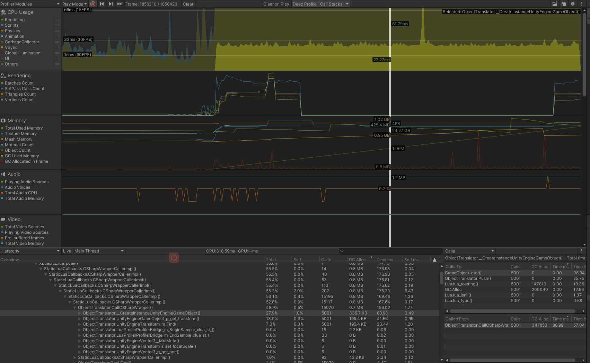
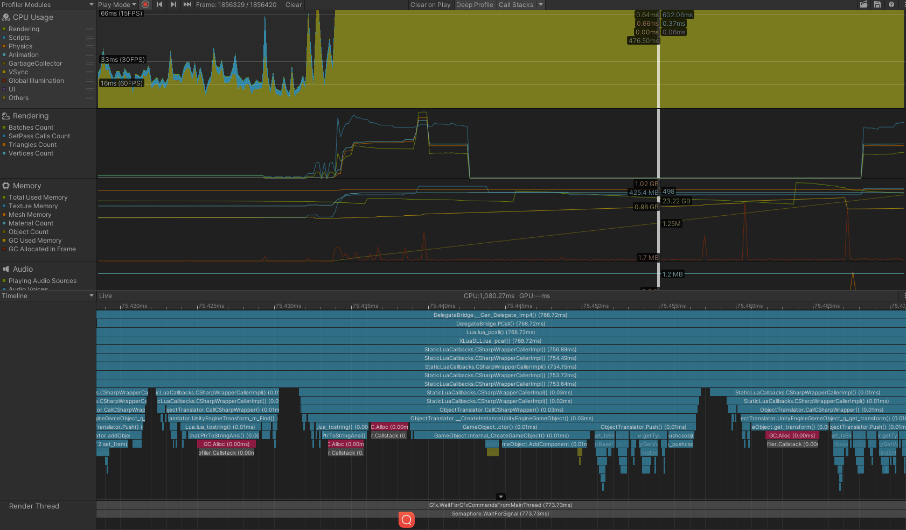
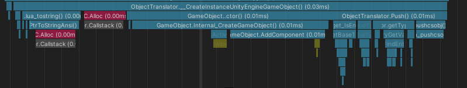
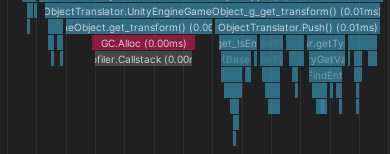
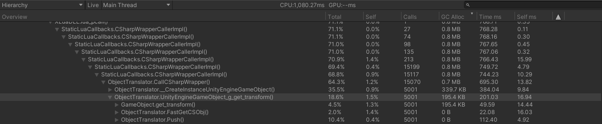
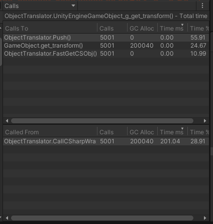
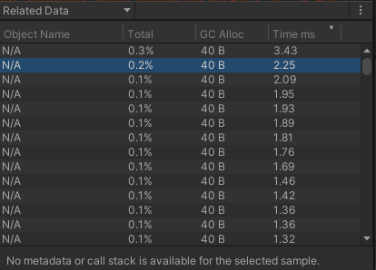
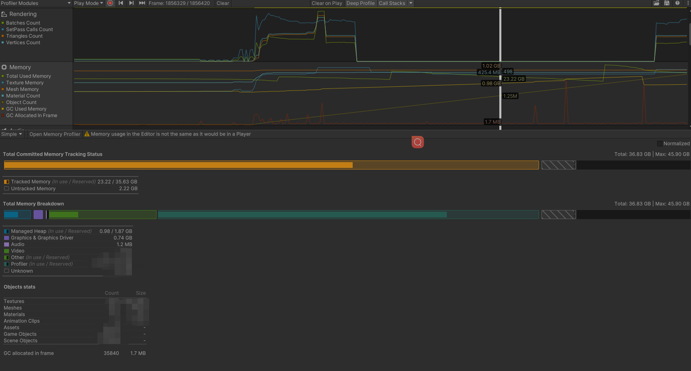

# Profile使用记录

## 面板基础内容



> 需要开启Deep Profile才能看到每个函数在Cpu的执行时间和内存分配等信息

Profile Moudule面板能够看到所有数据的开销，包括CPU，GPU(默认没开启)，内存，UI，音频等

可以通过点击选择Profile Moudule中不同的面板查看

## CPU Useage模块

这些片段可以用于具体分析各个代码的使用情况，由于主要通过Xlua来完成对Unity的操作，因此实际分析也需要通过XLua的相关内容，如`ObjectTranslator`类进行分析。

在下图展示的面板中选中某一帧的CPU主线程的执行情况。在Timeline中，自上而下表示根函数和调用的子函数。


如该段图片中主要执行以下lua代码
```lua
function Panel: _testProfile()
    for i = 0, 5000, 1 do
        local obj = CS.UnityEngine.GameObject(tostring(i))
        obj.transform:Find("Transform")
    end
end
```


因此该段时间片的主函数为LuaEnv中Objectranslator下的实例化函数，该函数会分别调用
- `Lua.lua_tostring()`，在代码中为`tostring(i)`; 
- `GC.Alloc`分配GO需要使用的空间;
- `GameObject..ctor()`调用实例化GO的构造函数
- `ObjectTranslator.Push()`将GO的数据Push到Lua虚拟机中
上述代码也会调用各自的子函数进行执行


该段时间片为运行代码中的`obj.transform:Find("Transform")`，用于寻找GO的Transform组件。


## Hierarchy组件

当切换为`Hierarchy`窗口时可以直接看到代码调用相关的信息
> （这些信息被Profile集中起来，比如`ObjectTranslator.UnityEngineGameObject_g_get_transform()`函数总共会执行5001次，但在该窗口会只显示这一部分内容, 如果切换为RawHierachy 则会根据函数运行情况来显示）



后续内容为:
1. Total: 该函数占总用的百分比
2. Self: Unity在一个特定函数上花费的总时间百分比，不包括Unity调用子函数的时间。
3. Call: 该函数被调用的次数（在Raw
4. CG Alloc: 当前帧该函数被分配了多少内存，
5. Time ms: Unity在该函数上花费的时间具体值
6. Self ms: Unity在当前函数（不包含子函数）上花费的时间具体值

> CG Alloc表示当前被分配的空间收到GC管理，实际上所有堆空间的数据分配都会被GC管理，当主动调用GC.clloct()或分配数据过多导致自动GC时，GC管理器会标记所有的不再引用的空间分配并收集它们。<br>
> 当堆内存被分配过多时，Unity需要更长时间的标记和清除，因此避免GC即时尽可能避免GC Alloc分配内存。


### Calls 模块
Calls模块用于展示当前函数依赖的其他函数，包括调用它的函数，和他调用的函数


### Related Data 模块
该模块用于展示与当前函数有关的所有数据的用时和分配空间，比如该上述内容就是生成GO数据


## Memory模块
该模块下可以看到内存具体的使用情况，包括已被使用的内存占用情况
