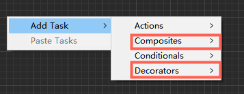
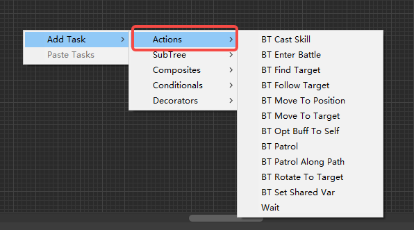
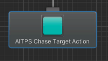
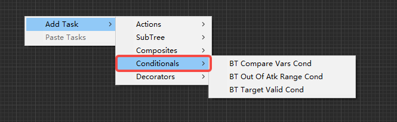
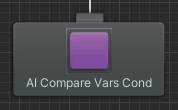
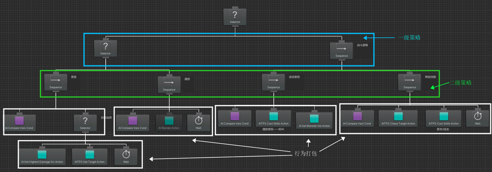

# AI行为树

## 节点说明

### 中间节点

中间节点用于聚合子树的逻辑，主要分为复合节点和修饰节点。

#### 复合节点(Composite)
目前仅允许三类复合节点：Selector、Sequence及RandomSelector。
1. **Selector**：当一个Selector节点被执行时，它会按照从左到右的顺序检查它的子节点，如果某个子节点返回成功，那么Selector节点会立即返回成功；如果所有子节点都返回失败，那么Selector节点会返回失败。
2. **Sequence**：当一个Sequence节点被执行时，它会按照从左到右的顺序执行它的子节点，只有当所有子节点都返回成功时，Sequence节点才会返回成功；如果有任何一个子节点返回失败，那么Sequence节点会立即返回失败。
3. **RandomSelector**：当一个RandomSelector节点被执行时，它会随机选择一个子节点来执行，如果选择的子节点返回成功，那么RandomSelector节点会返回成功；如果选择的子节点返回失败，那么RandomSelector节点会选择另一个子节点来执行，直到所有子节点都被执行完为止。

#### 修饰节点(Decorator)
用于对子树返回结果进行修饰，现有节点如下：
1. **Conditional Evaluator**：当一个Conditional Evaluator节点被执行时，它会执行一个条件判断，只有当条件成立时，才会执行它的子节点，否则直接返回失败。
2. **Cooldown**：当一个Cooldown节点被执行时，它会等待一段时间，然后再执行它的子节点。如果在等待期间节点被调用，那么Cooldown节点会返回失败。
3. **Interrupt**：当一个Interrupt节点被执行时，它会检查是否有其他的高优先级节点需要执行，如果有，则Interrupt节点会立即返回失败，否则它会执行它的子节点。
4. **Inverter**：当一个Inverter节点被执行时，它会执行它的子节点，如果子节点返回成功，那么Inverter节点会返回失败；如果子节点返回失败，那么Inverter节点会返回成功。
5. **Repeater**：当一个Repeater节点被执行时，它会重复执行它的子节点，直到子节点返回失败。可以设置重复次数或者无限循环。
6. **Return Failure**：当一个Return Failure节点被执行时，会立即返回失败。
7. **Return Success**：当一个Return Success节点被执行时，会立即返回成功。
8. **Task Guard**：当一个Task Guard节点被执行时，它会检查一个条件是否成立，如果条件成立，那么它会执行它的子节点，否则直接返回失败。
9. **Until Failure**：当一个Until Failure节点被执行时，它会重复执行它的子节点，直到子节点返回失败。
10. **Until Success**：当一个Until Success节点被执行时，它会重复执行它的子节点，直到子节点返回成功。

### 行为节点

#### 动作节点（Action）

Action节点是行为树中的基本执行单元，它们表示AI角色需要执行的具体行为或操作。Action节点通常负责执行一项任务，如移动、攻击、施放技能等。在行为树中，Action节点作为叶子节点，它们没有子节点，并且在执行过程中，它们可以返回成功、失败或进行中的状态。项目中统一标为青色。

#### 条件节点（ConDitional）

Conditional节点在行为树中起到决策作用，它用于评估一组条件，以确定AI角色应该执行的下一步行为。Conditional节点通常与Action节点（执行实际行为的节点）配合使用，以便在满足特定条件时触发特定的行为。这样可以让AI角色在不同的情况下做出不同的决策和响应。项目中统一标为紫色。

## 配置原则
- **结构清晰**：使用选择器（Selector）和序列器（Sequence）节点组织行为树，使结构清晰易懂。至少采用双级架构设计行为树，例如，一级策略层可以抽象为非战斗状态、战斗状态两大类；二级策略层使用一个选择器节点作为根节点，分别连接巡逻、追击、攻击和逃跑等子行为。使用Selector和Sequence节点合理打包Conditional节点和Action节点，提高可读性及可维护性。使用Selector和Sequence节点合理打包Conditional节点和Action节点，提高可读性及可维护性。

- **模块化设计**：将AI角色的行为和逻辑划分为独立的模块，这样可以更容易地重用和组合这些模块。例如，可以将可以将通用行为模块分别配置为独立的子树，然后在主行为树中通过不同的Conditional节点组合这些子树。

- **随机性**： 增加AI角色行为的多样性，在行为树中添加随机性。比如使用随机选择器来随机决定AI角色执行攻击或防御行为。

- **性能优化**：
    - **条件判断节点**：条件判断节点永远放在一组行为的最前面。例如，选择目标前先执行当前目标有效性判断，避免重复执行开销很高的动作。
    - **优先级设置**：
        1. 为选择器节点中的子行为设置优先级。例如，将攻击行为设置为最高优先级，确保在有攻击目标时优先执行攻击。
        2. 将计算成本较低的条件判断放在前面将计算成本较低的条件判断放在前面。例如，在判断是否攻击前，先检查敌人是否在攻击范围内，避免不必要的攻击计算。
    - **避免频繁切换**：为敌人AI设置冷却时间，防止频繁切换行为，在行为树中合理添加Wait节点。例如，敌人在逃跑行为结束后，需要等待一段时间才能再次逃跑。

