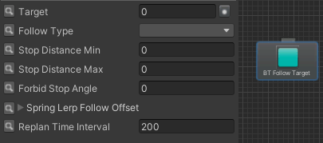
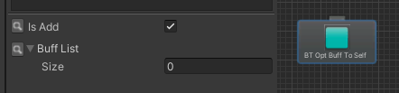

# AI行为节点说明
## 行为节点

### 释放技能 (BTCastSkill)

  - Target: 目标 
  - SkillId: 技能ID
  - Auto Select Skill Id: 自动选择技能ID，勾选后Skill失效
  - Wait End: 勾选： 技能结束后节点才结束。 不勾选：技能开始释放就结束。
  - Timeout period: 超时时间。

### 主动进入战斗 (BTEnterBattle)

  - Target:  目标 
  - Auto Battle:  自动接管战斗(目前仅SLG生效)

### 筛选目标 (BTFindTarget)

  - Target Type:  筛选类型
  - Save 2 Target:  存储至黑板变量
  - Radius: 半径
  - Height: 高度
  - Angle: 角度 (以AI朝向为基准)
  - Camp Filter: 阵营筛选
  - Entity Types: 指定单位类型
  - Entity Tags: 指定单位标签
  - Player Only: 仅玩家单位
  - Attribute Filter: 属性筛选类型
  - Attr Id:  属性ID (属性筛选类型非  None生效)
  - Death Enable: 不过滤死亡单位

### 跟随目标 (BTFollowTarget)

  - Target:  目标 
  - Follow Type：跟随类型（Normal - 依赖移速走移动系统。SpringLerp - 不依赖移动速度，固定插值算法跟随 ）
  - Stop Distance Min:  停止距离最小值(仅Normal生效)
  - Stop Distance Max: 停止距离最大值(仅Normal生效)
  - Forbid Stop Angle: 禁停角度(全角，以目标朝向为基准 仅Normal生效)
  - Spring Lerp Follow Offset: 跟随偏移(仅SpringLerp生效，以目标朝向为基准)
  - Replan Time Interval: 检测间隔  单位ms

### 移动到指定位置 (BTMoveToPosition)

  - Type: 移动类型.   1. CUSTOM_POS(指定位置)   2.BORN_POS(出生位置)  3. ENCOUNTER_POS (进入战斗位置)
  - Target Postion: 指定位置 (仅CUSTOM_POS生效)
  - Ignore Y: 忽略Y值 (仅CUSTOM_POS生效)
  - Timeout Duration: 超时时间，超过该时间结束移动并返回失败

### 朝向指定目标移动 (BTMoveToTarget)

  - Target:  目标 
  - Stop Distance: 停止距离
  - Replan Time interval: 重新规划路径间隔
  - Replan Distance Error: 重新规划目标点位置差值

### 对自己添加/删除Buff (BTOptBuffToSelf)

  - Is Add: 勾选 - 添加  不勾 - 移除
  - Buff List: buff Id 列表

### 随机点巡逻 (BTPatrol)

  - Radius: 随机半径

### 固定路径巡逻 (BTPatrolAlongPath)

  - Path Id: 路径ID，找关卡策划要

### 朝向目标 (BTRotateToTarget)

  - Target: 目标
  - Rotate Duration: 转向时间
  - Rotate Speed: 转向速度  (角度/秒)

### 黑板数据修改（BTSetSharedVar）

  - Variable: 黑板变量
  - Var Value: 数值
  - Is Global：是否全局数据

### 延迟节点 (Wait)

  - Wait Time: 非随机等待时间
  - Random Wait: 是否使用随机等待
  - Random Wait Min: 随机等待最小时间
  - Random Wait Max: 随机等待最大时间

## 条件节点

### 黑板数据比较 （BTCompareVarsCond）

  - Left Operand：做操作数
  - Right Operand: 右操作数
  - Is Left Operand Global: 左操作数是全局黑边变量
  - Is Right Operand Var Name: 右操作数配置是否为黑板变量名称
  - Op Type: 比较类型
### 事件检测 （BTDetectEvent）

  - Event Id: 检测事件ID
  - Event Params: 事件匹配参数
  - Saved Result: 存储至黑板变量
  - Reset Result After Processed: 执行后，重置存储数据(Saved Result)
  - Restart BT: 重新运行行为树
### 目标有效性检测 （BTTargetValidCond）

  - Target ID: 目标
  - Is Alive: 是否必须是存活单位
  - In Atk Range：是否必须在攻击范围内
  - Is Fight Back Target：是否为反击目标
  - Target Type Filter：是否指定目标类型