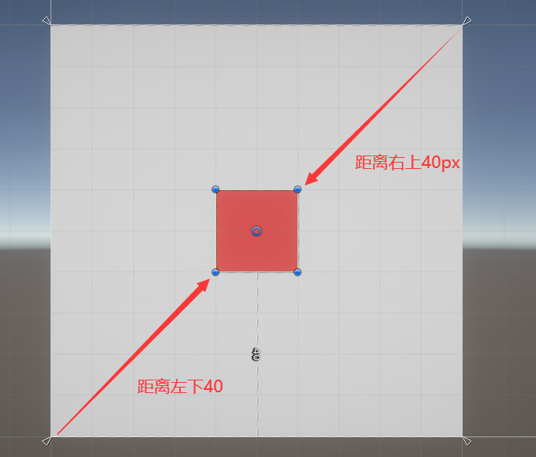
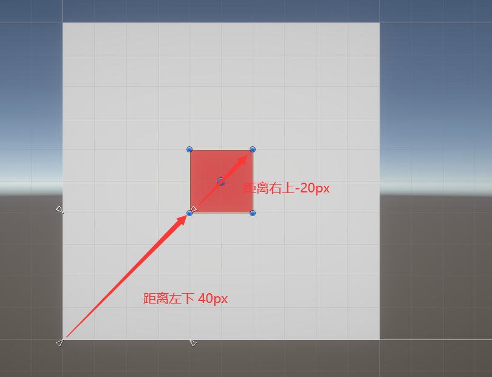

# Pivot和Anchor

## 区别

### Pivot 中心点
用于描述

该内容是一个X,Y值范围是0到1的点，这个点的会在Anchor（锚点）计算位置的时候会使用到，下面用一张图来解释Pivot点的位置

> 设置Pivot的坐标系如上图，(0,0)表示红框物体的左下角的点，(1,1)表示红框物体的右上角的点

### Anchor 锚点/锚框

用于定义子物体相较于父物体位置的内容

Anchor有四个值，分别是xMin, xMax, yMin, yMax, 用于确定点，线，框

### 属性详解

#### 情况1 锚点

当Anchor为一个点时，子物体rectTransform的值描述了 子物体pivot距离锚点的相对距离

#### 情况2 锚线

当Anchor为一条线时，子物体的RectTransform描述了子物体左下角和右上角距离锚线的位置

#### 情况3 锚框

当Anchor为框时，子物体的RectTransform描述了子物体左下角和右上角距离锚框左下角和右上角的距离

#### 情况4 锚框不包含物体

## 常用方法

### Pivot

如果使用的是锚线或者锚点，那么物体相距锚点和锚线的距离就是固定的，此时通过改变Pivot的值，就可以控制UI生成的方向。