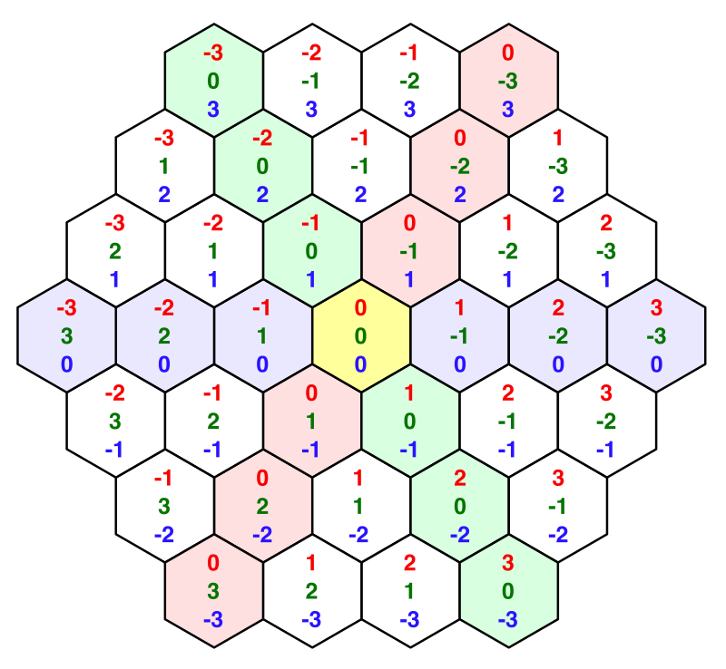

# 六边形地图创建

## 构造六边形网格

六边形网格的一个优势是每个小网格到相邻网格的距离都是固定的，因此其在计算网格距离会更有优势。

构造六边形网格的一个需要定义以下内容

1. 统一管理所有六边形网格的管理类`HexGrid`
    + 用于管理网格数据
    + 连接网格生成器
    + 作为六边形网格对外的窗口
2. 每个六边形网格`HexCell`
    + 该脚本本质上是存储六边形的一些数据，和挂载Mono，使其生成对应的prefab (如果不需要用Mono查看相关代码，其可以直接使用struct存储)
3. 六边形网格生成器`HexMesh`
    + 被`HexGrid`进行管理，用于生成实际需要的网格
    + 该生成器一次性生成所有网格，因此需要从hexGrid的中获取信息
4. 六边形网格的世界空间下画布
5. 网格的坐标转化器（获得每个小网格的在网格中的网格坐标，以及将世界坐标进行转化）


### 数据定义
首先在管理类中定义需要的网格信息，包括
+ 整个网格的长、宽
+ 每个小网格的大小 （外半径和内半径）
+ 顶点的数量和位置（从最上方开始，顺时针标记本地坐标系的位置）

### 构建网格


```cs
// HexMesh.cs
public void Triangulate(HexCell[] cells)
{
    hexMesh.Clear();
    vertices.Clear();
    triangles.Clear();
    colors.Clear();

    
    for (int i = 0; i < cells.Length; i++)
    {
        Triangulate(cells[i]);
    }

    hexMesh.vertices = vertices.ToArray();
    hexMesh.triangles = triangles.ToArray();
    hexMesh.colors = colors.ToArray();
    hexMesh.RecalculateNormals();
    
    collider.sharedMesh = hexMesh;
}

void Triangulate (HexCell cell) {
    Vector3 center = cell.transform.localPosition;
    for (int i = 0; i < 6; i++)
    {
        AddTriangle(center, center + HexMetrics.corners[i], center + HexMetrics.corners[(i + 1) % 6]);
        AddTriangleColor(cell.color);
    }
}

void AddTriangle(Vector3 v1, Vector3 v2, Vector3 v3)
{
    int vertexIndex = vertices.Count;
    vertices.Add(v1);
    vertices.Add(v2);
    vertices.Add(v3);
    triangles.Add(vertexIndex);
    triangles.Add(vertexIndex + 1);
    triangles.Add(vertexIndex + 2);
}

// 三个顶点都需要颜色
void AddTriangleColor(Color color)
{
    colors.Add(color);
    colors.Add(color);
    colors.Add(color);
}
```

### 坐标设置

定义坐标信息，提供转化方法

为了便于坐标校验，一般来说六边形地图的坐标都要需要保证 x + y + z = 0

且需要让整个图形的偏移更符合直觉，每向上便宜一行，则对应的坐标也要向右偏移一格



因此 坐标为 `(x - z / 2, z)`, 而Y就是 0 - x - y


## 触摸网格

触摸网格的可以通过向Grid发出射线，当射线碰撞到大网格时，返回大网格的本地坐标，并将本地坐标转化为网格坐标即可

转化代码，用了一些Trick，以z轴偏移两行为一个周期来避免来回的偏移

```cs
public static HexCoordinates FromPosition(Vector3 position)
{
    float x = position.x / (HexMetrics.innerRadius * 2f);
    float y = -x;   // 此时假设z = 0;
    float offset = position.z / (HexMetrics.outRaduis * 3f);        // 
    x -= offset;        // 同x坐标的网格，z + 1在z的右上方，因此z偏移会让x和y均偏移
    y -= offset;
    
    // 进行坐标校验
    int iX = Mathf.RoundToInt(x);
    int iY = Mathf.RoundToInt(y);
    int iZ = Mathf.RoundToInt(-x -y);

    if (iX + iY + iZ != 0)
    {
        float dX = Mathf.Abs(x - iX);
        float dY = Mathf.Abs(y - iY);
        float dZ = Mathf.Abs(-x -y - iZ);

        if (dX > dY && dX > dZ)
        {
            iX = -iY - iZ;
        }else if (dZ > dX && dZ > dY)
        {
            iZ = -iY - iX;
        }
    }
    
    return new HexCoordinates(iX, iZ);
}
```


## 绘制网格颜色

绘制网格的时候，给网格传递每个顶点的顶点色，就可以让网格在被Shader绘制的时候，将顶点颜色作为顶点着色器的参数传入，此时，只要顶点着色器将颜色再传递给片段着色器即可实现对不同网格的着色。

