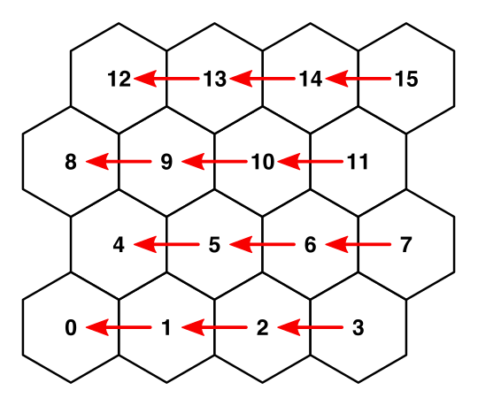
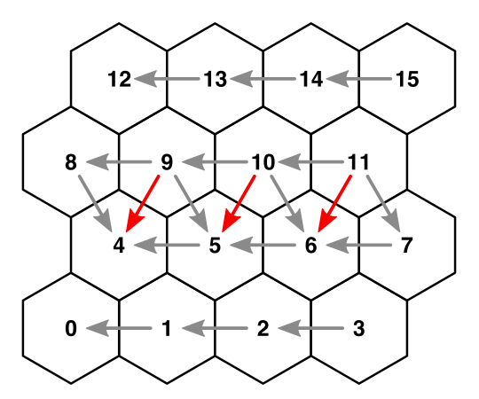
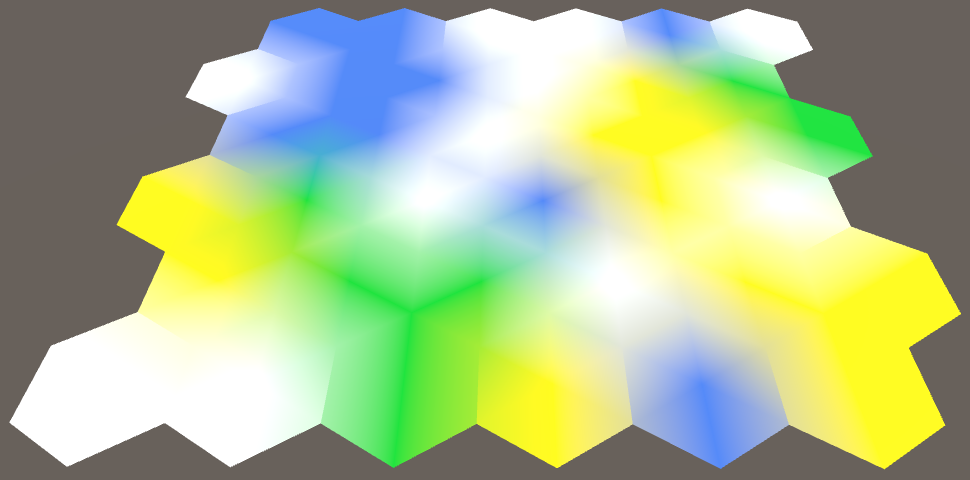
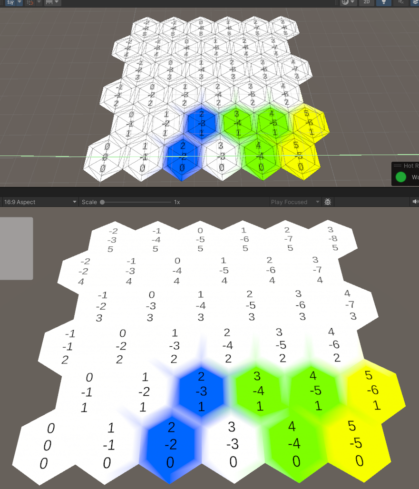
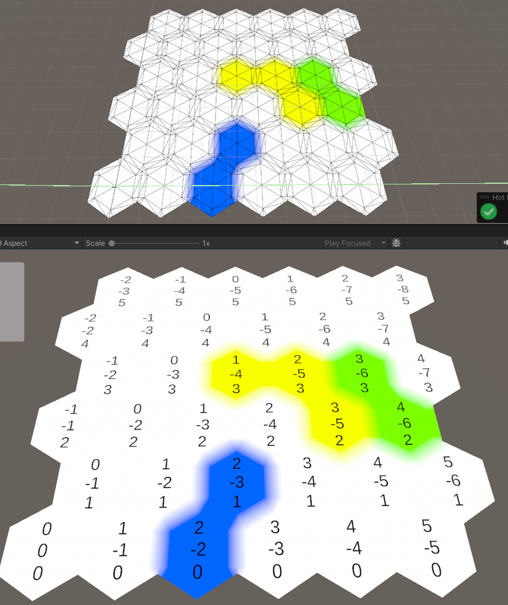
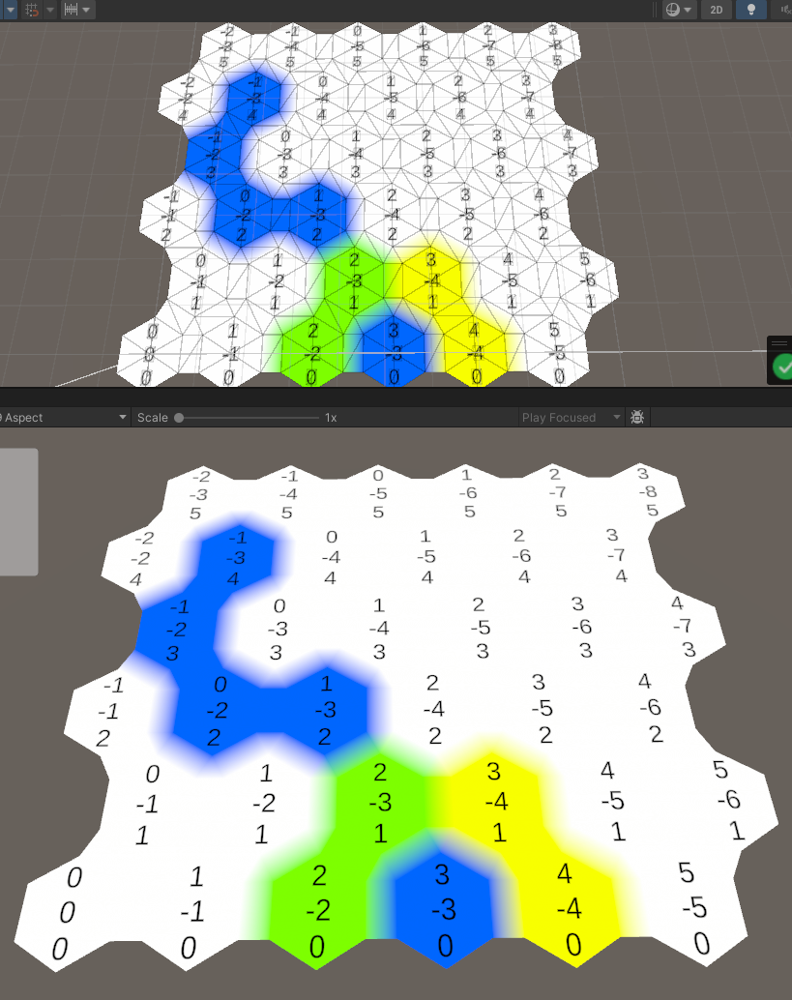

# 颜色混合

为了实现不同六边形的颜色混合，需要获得邻居六边形接壤的顶点颜色，然后对颜色进行混合， 因此核心是怎么获取邻居，且怎么获得邻居接壤的顶点颜色，并进行混合

## 获得邻居

获得邻居的一个简单方式就是，在mesh生成cell的时候就将邻居存储到自己的hexCell脚本中（可以优化为新的结构，然后用坐标进行记录）

为了简化操作，可以增加方向，然后用方向来正向或反向获得其他邻居信息。并且设置邻居时，使用双向设置。

```cs
public enum HexDirection{ NE, E, SE, SW, W, NW }
    
    public static class HexDirectionExtensions
    {
        public static int HexDirectionLen => Enum.GetValues(typeof(HexDirection)).Length;
        
        public static HexDirection Opposite (this HexDirection direction)
        {
            return (HexDirection)((int)(direction + 3) % HexDirectionLen);
        }

        public static HexDirection Previous(this HexDirection direction)
        {
            return (HexDirection)(((int)direction + (HexDirectionLen - 1)) % HexDirectionLen);
        }
        
        public static HexDirection Next (this HexDirection direction)
        {
            return (HexDirection)(((int)direction + 1) % HexDirectionLen);
        }
        
    }
```

### 横向邻居设置方式

横向方向设置邻居，只需要考虑x > 0时候的节点，因此可以双向设置，因此当设置下标为1以后得cell时，一定会拿到前方的cell。



### 侧方向设置邻居

侧方向设置邻居分为奇数行和偶数行, 由于可以双向设置，因此直接从上往下设置最好, 且X == 0 因此也不需要设置。



+ 对于偶数行（下标大于0的cell）
    + 一定有SE 方向邻居
    + z == 0 时没有SW方向邻居 其他都有
+ 对于奇数行 （下标 %2 == 1 的cell )  与偶数行相反，其一定有的是SW方向的邻居，最后一个没有SE方向邻居
    + 一定有SW方向邻居
    + z == maxWidth - 1时，没有SE方向令居


## 颜色混合

由于我们已经设置了顶点色，片元着色器会根据顶点色对六边形进行插值处理。因此最核心的是对顶点色的配置

### 直接平均

最简单的方法是直接让顶点色为所有接壤六边形颜色的平均值，但这种方法得到的顶点色会让整个六边形糊在一起，没有区分度。



### 用梯形区分原始色和过渡色

六边形糊在一起的原因是整个六边形的颜色都被邻居的顶点色差值了，因此如果要保证不糊，就需要在六边形的特定区域范围内进行插值。


#### 基础梯形

一个简单的办法是将六边形按照某一个比例阶段，每一个组成部分的三角形划分为 一个小三角型和一个梯形，而梯形范围则是混合区域。

可以通过规定实心范围和混合范围，来确定三角形和梯形的顶点位置

```cs
// HexMetrics.cs
public const float solidFactor = 0.75f;
public const float blendFactor = 1 - solidFactor;

public static Vector3 GetFirstCorner(HexDirection direction)
{
    return corners[(int)direction];
}

public static Vector3 GetSecondCorner(HexDirection direction)
{
    return corners[(int)direction + 1];
}

public static Vector3 GetFirstSolidCorner(HexDirection direction)
{
    return corners[(int)direction] * solidFactor;
}

public static Vector3 GetSecondSolidCorner(HexDirection direction)
{
    return corners[(int)direction + 1] * solidFactor;
}

```

```cs
// HexMEsh.cs
void AddQuad (Vector3 v1, Vector3 v2, Vector3 v3, Vector3 v4) {
    int vertexIndex = vertices.Count;
    vertices.Add(v1);
    vertices.Add(v2);
    vertices.Add(v3);
    vertices.Add(v4);
    triangles.Add(vertexIndex);
    triangles.Add(vertexIndex + 2);
    triangles.Add(vertexIndex + 1);
    triangles.Add(vertexIndex + 1);
    triangles.Add(vertexIndex + 2);
    triangles.Add(vertexIndex + 3);
}

void AddQuadColor (Color c1, Color c2, Color c3, Color c4) {
    colors.Add(c1);
    colors.Add(c2);
    colors.Add(c3);
    colors.Add(c4);
}

void Triangulate (HexDirection direction, HexCell cell) {
    Vector3 center = cell.transform.localPosition;
    Vector3 v1 = center + HexMetrics.GetFirstSolidCorner(direction);
    Vector3 v2 = center + HexMetrics.GetSecondSolidCorner(direction);

    AddTriangle(center, v1, v2);
    AddTriangleColor(cell.color);

    Vector3 v3 = center + HexMetrics.GetFirstCorner(direction);
    Vector3 v4 = center + HexMetrics.GetSecondCorner(direction);

    AddQuad(v1, v2, v3, v4);

    AddQuadColor(....)
}

```




#### 桥接方式

直接使用基础梯形的问题在于：梯形的底边中间部分本应该只受到对应方向邻居的影响，但是实际收到了来自邻居前向或者后方邻居颜色影响。

因此一个方案是，梯形在细分为两个边缘三角形和一个矩形，矩形的颜色受到实心三角形和邻居颜色影响，而三角形受到多个六边形印象



#### 基于桥接的优化

桥接效果很好的完成颜色的划分，但是三角形太多了，很多三角形其实可以简化，比如两个矩形就可以合并为一个，多个六边形的梯形三角形可以组成一个更大的三角形。从而减少三角形数量

首先是简化矩形，从图中可以发现，从左往右，从下往上看，每个六边形，只需要其实只需要NW, NE，E三个方向的邻居有桥接矩形就行，因此可以当有这三个邻居时，就去获取邻居接壤顶点位置，然后生成矩形。

简化三角形的时候可以发现，实际上只有当NE和E方向的邻居有下一个邻居的时候，才需要生成新的三角形，因此可以通过自己，邻居和邻居的下一个邻居三个的顶点来生成三角形

```cs
void Triangulate(HexDirection direction, HexCell cell)
    // 为了防止重复，只有前三个方向才有桥接需求
    if (direction <= HexDirection.SE)
    {
        TriangulateConnection(direction, cell, v1, v2);
    }
}

void TriangulateConnection(HexDirection direction, HexCell cell, Vector3 v1, Vector3 v2)
{
    Vector3 bridge = HexMetrics.GetBridge(direction);
    Vector3 v3 = v1 + bridge;
    Vector3 v4 = v2 + bridge;
    
    HexCell neighbor = cell.GetNeighbor(direction);

    if (neighbor == null)
    {
        return;
    }
    
    AddQuad(v1, v2, v3, v4);
    AddQuadColor(cell.color, neighbor.color);
    
    // 为有邻居的增加小三角形
    HexCell nextNeighbor = cell.GetNeighbor(direction.Next());
    // SE方向的小三角型回合 左下方的ne方向三角形重叠，因此只需要两个临边创建三角形
    if (direction <= HexDirection.E && nextNeighbor != null)
    {
        AddTriangle(v2, v4, v2 + HexMetrics.GetBridge(direction.Next()));
        AddTriangleColor(cell.color, neighbor.color, nextNeighbor.color);
    }
}

```





